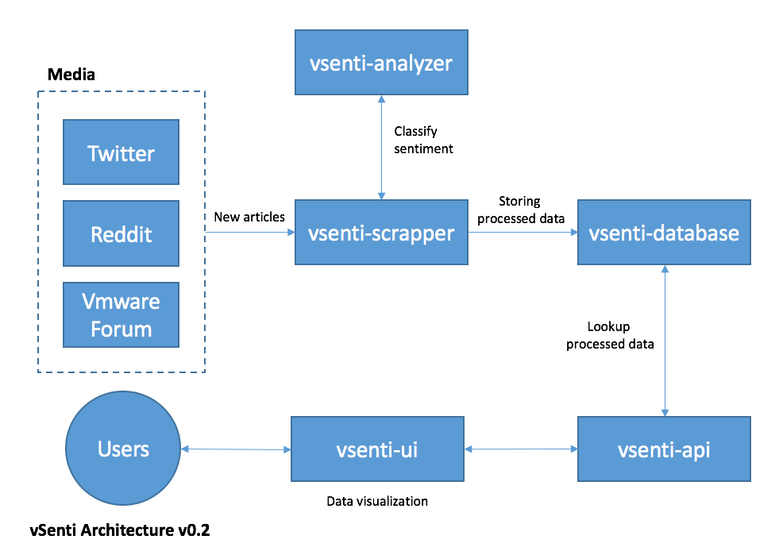

# vSenti
Real time tweets sentiment visualizer for VMware brand

## Goals
* ~~Inspired by [usa live tweets](https://usa2016livetweets.herokuapp.com/), offer live sentiment analysis of VMware related tweets~~
* With [libscore](http://libscore.com) style of UI, offer time series sentiment analysis of 3 VMware core products: vSphere, vSAN and NSX, from various data sources
* Train classifier that gives sentiment confident level above 60%

## Architecture
Below is the workflow and platform architecture of vSenti:

